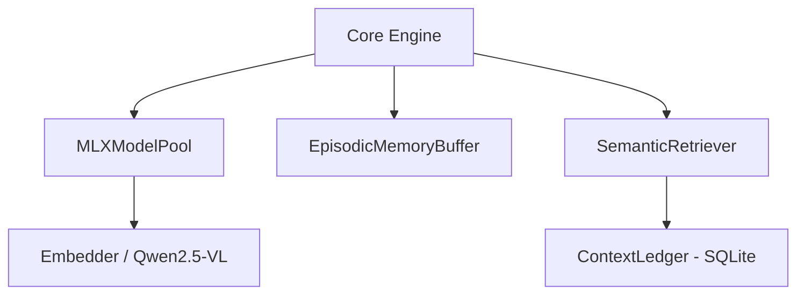
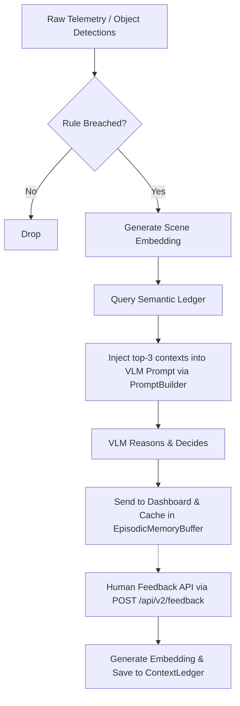
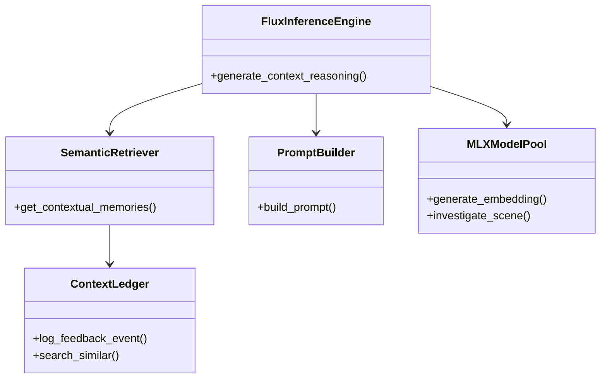

# Principal Architecture Review: Adaptive Edge Intelligence for FluxState

**Document Type:** Principal AI Architecture & Product Strategy Review
**Target Version:** FluxState Edge SDK Evolution (v1.1)
**Author:** AI Systems Architecture & Research

---

## 1. Industry State of the Art & Competitive Landscape (2025–2026)

To build a category-defining Edge AI platform, we must first deconstruct how the industry currently approaches adaptation and edge intelligence.

### **The Legacy Giants (Genetec, Milestone, Avigilon, Axis)**
*   **Approach:** Statistical Baselining & Deep Rule Engines.
*   **Adaptation:** Avigilon’s UMD (Unusual Motion Detection) is the gold standard here. It builds statistical pixel-level heatmaps of "normal" motion vectors over weeks. If motion deviates, it flags it.
*   **Gap:** It has zero semantic understanding. It knows *motion* is anomalous, but it doesn't know *why*. It is entirely static regarding human feedback (a guard cannot say "that's just a forklift, ignore it forever").

### **The Cloud-Native Disruptors (Verkada, Cisco Meraki, Ambient.ai)**
*   **Approach:** Edge inference for standard models (YOLO variants) + Cloud compute for heavy reasoning (Ambient.ai). 
*   **Adaptation:** Ambient.ai uses complex signature-based rules and LLM-assisted context, but their continuous learning pipeline relies heavily on centralizing customer data in the cloud to retrain global models. Verkada updates firmware centrally.
*   **Gap:** Lack of true privacy-first, *localized* on-device learning. They learn globally, not specifically for "Camera 4 in Warehouse B" without massive cloud roundtrips.

### **The AI Infrastructure Providers (NVIDIA DeepStream/Metropolis, AWS Panorama)**
*   **Approach:** Pipelines and Compute primitives. 
*   **Adaptation:** NVIDIA offers TAO (Train Adapt Optimize) Toolkit. You collect edge data, send it to a server, fine-tune the model, and push weights back via Fleet Command. 
*   **Gap:** Requires heavy MLOps engineering. It is offline, batch-processed, and requires moving data off the edge device.

### **The Differentiator for FluxState**
*   **What Exists:** Statistical anomaly detection, rule-based alerts, cloud-based model retraining.
*   **What is Experimental:** Federated Learning for video, on-device gradient updates (too fragile, catastrophic forgetting is rampant).
*   **The FluxState Novelty:** **On-Device Semantic RAG for Edge Vision-Language Models.** We are not updating statistical pixels (Avigilon) or retraining weights in the cloud (NVIDIA). We are using a localized semantic ledger to allow a zero-shot VLM to "remember" previous human feedback and contextually reason about the present scene, entirely on Apple Silicon edge nodes.

---

## 2. Challenging the Current Assumptions

The previously proposed architecture relied heavily on **Epsilon-Greedy Statistical Policy Drift** (e.g., drifting a threshold from 3 to 5 if False Positives are high). 

**Challenge 1: Statistical drift is "dumb" and fragile.**
*   *Critique:* If you just increase a threshold because of False Positives (FPs), the system becomes less sensitive overall. If a guard flags 10 "IT guys carrying laptops" as FP, shifting the global `RF_PAYLOAD_ANOMALY` threshold up makes the system blind to actual data exfiltration by a bad actor. 
*   *Alternative:* **Semantic Environment Memory (RAG)**. We must remember *why* it was an FP, not just adjust a number.

**Challenge 2: SQLite as a pure event ledger is insufficient.**
*   *Critique:* Standard SQL queries cannot match "visual similarity" or "semantic intent."
*   *Alternative:* We must integrate a localized Vector Database (or `sqlite-vec` extension). We embed the visual and semantic context of events so we can recall *similar* situations, not just temporally coincident ones.

**Challenge 3: Absolute refusal to do model retraining.**
*   *Critique:* RAG (prompt injection) grows the context window, slowing down inference latency linearly and increasing memory usage. 
*   *Alternative:* We rely on RAG for MVP to guarantee stability, but acknowledge that local Knowledge Distillation (via MLX LoRA adapters) is required long-term to compress that memory into the weights for speed.

---

## 3. The Architecture: Semantic Edge RAG (v1.1)

The optimal balance of privacy, explainability, and determinism is a system that uses **Semantic Retrieval-Augmented Generation (RAG)** bounded by **Deterministic Policy Guardrails (DPG)**.

### **A. Memory Architecture (The 3 Tiers)**
1.  **Episodic Memory (RAM):** The last 10 minutes of scene states managed by `EpisodicMemoryBuffer`. Used for buffering immediate context so delayed operator feedback can still reference the exact scene.
2.  **Semantic Ledger (Local Vector DB):** A database of past *resolved* edge cases (Events where a human intervened or gave feedback). Stored as vector embeddings of the VLM's scene description + the human's feedback via `ContextLedger`.
3.  **Statistical Baseline (SQLite):** Time-series data of "normal" (e.g., average occupancy at 5 PM).

### **B. The Adaptive Data Flow**
1.  **Event Triggers:** The static rule engine flags an anomaly.
2.  **Semantic Retrieval:** Before asking the VLM to reason, `SemanticRetriever` embeds the current scene description and queries the **Semantic Ledger** for the top 3 similar past events (Cosine Similarity > 0.85).
3.  **Contextual Prompting (The Adaptation):**
    `PromptBuilder` injects retrieved memories into the Qwen2.5-VL prompt.
    > *"Analyze this scene. Note: 3 days ago, in a highly similar visual context, you flagged an anomaly. The Human Operator marked it as FALSE POSITIVE stating 'IT Maintenance Staff'. Given this historical context, is the current scene a true threat or a repeat of the benign baseline?"*
4.  **Feedback Loop:** If the operator clicks "False Positive" on the dashboard, the API `POST /api/v2/feedback` receives it, retrieves the event from the `EpisodicMemoryBuffer`, embeds it, and saves it to the `ContextLedger`. **The system has instantly "learned" without updating a single neural weight.**

---

## 4. Safety Mechanisms & Drift Prevention

*   **Feedback Poisoning Protection:** Security guards are notorious for silencing alarms out of laziness. 
    *   *Solution:* Role-based memory weighting. Operator feedback is cryptographically signed via JWT.
*   **Deterministic Override (DPG):** No matter what the VLM "remembers", if a hard-coded threshold is violently breached, the semantic memory can be overridden or strongly weighted. Explainability is preserved.
*   **No Auto-Suppression:** Following validation testing, the "Fast-Path Auto-Reject" was removed to prevent critical false negatives. All semantic similarities strictly augment the VLM context; the VLM or human operator always makes the final call.

---

## 5. Architectural Implementation Details

### Dependency Graph (Mermaid)

### Data Flow Diagram

### Module Diagram

### API Specification (v1.1)
*   **`POST /api/v2/feedback`**
    *   Payload: `{ "event_id": "uuid", "human_label": "FALSE_POSITIVE", "operator_id": "guard-123", "operator_role": "admin" }`
    *   Action: Fetches event from `EpisodicMemoryBuffer`, generates embedding using `MLXModelPool`, commits to `ContextLedger`.

### Apple Silicon execution & Thread Safety
- The system heavily relies on `MLXModelPool` which strictly manages shared unified memory on Apple Silicon devices. Only the embedding model or the VLM is loaded into active memory at one time, preventing OOM crashes on 8GB devices.
- `app.py` runs the inference in a background daemon thread, while exposing the Feedback API asynchronously via `http.server`. Threading conflicts are avoided through strict isolation.

---

## 6. Patent Opportunities & Research Novelty

*   **Patentable Concept:** *"System and Method for Contextual Adaptation of Edge-Deployed Vision-Language Models via Multi-Modal Semantic RAG and Role-Weighted Human Feedback."*
*   **Novelty:** Applying standard LLM RAG architectures to **physical security edge devices** using visual and text embeddings, specifically designed to bypass catastrophic forgetting in vision models without requiring cloud compute. 
