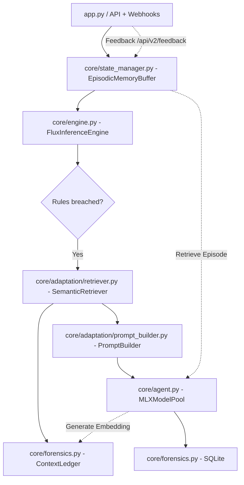

# Implementation Roadmap: Adaptive Edge Intelligence

**Document Type:** Principal Staff Engineer Implementation Plan
**Status:** **v1.1 Implementation Complete**

---

## Phase 1: Codebase Audit & Migration Strategy

### Current Architecture (v1.1 Frozen Baseline)

**Target Architecture (Implemented):**

### File-by-File Migration Complete

| File | Status | Modifications Made |
| :--- | :--- | :--- |
| `app.py` | ✅ Complete | Added `/api/v2/feedback` webhook ingestion endpoint. Integrated `EpisodicMemoryBuffer` for delayed logging. |
| `core/agent.py` | ✅ Complete | Created `MLXModelPool`. Added model unloading logic to manage VLM and Embedder. |
| `core/engine.py` | ✅ Complete | Added Semantic RAG pipeline hook `generate_context_reasoning`. |
| `core/forensics.py` | ✅ Complete | Created `ContextLedger` functionality on top of SQLite to store semantic vectors. |
| `core/state_manager.py` | ✅ Complete | Implemented `EpisodicMemoryBuffer` with a 10-minute TTL and thread locks. |
| `core/adaptation/embedder.py` | ✅ Complete | Implemented semantic string generation and `EmbeddingManager` stubs. |
| `core/adaptation/retriever.py` | ✅ Complete | Implemented Cosine Similarity search over `ContextLedger`. |
| `core/adaptation/prompt_builder.py`| ✅ Complete | Formats retrieved histories into strict Qwen prompts. |

---

## Phase 2: Implementation Checklist (Completed)

### Task 1: ContextLedger & SQLite Migration
*   **Status:** ✅ Complete
*   **Implementation:** Upgraded `forensics.py` to support semantic events. Created tables and methods for cosine similarity retrieval without external vector DB dependencies.

### Task 2: MLXModelPool (Agent.py Refactor)
*   **Status:** ✅ Complete
*   **Implementation:** Refactored `agent.py`. Integrated `MLXModelPool` to safely multiplex a VLM and an Embedding model on Apple Unified Memory with strict unloading.

### Task 3: Semantic Retriever & Prompt Builder
*   **Status:** ✅ Complete
*   **Implementation:** Created `retriever.py` and `prompt_builder.py`. Connected the embedding generator to the ContextLedger and formatted historical context for RAG injection.

### Task 4: FluxEngine Integration
*   **Status:** ✅ Complete
*   **Implementation:** Wired the new Adaptive modules into the main inference loop in `engine.py`. Included `ADAPTIVE_INTELLIGENCE` fallback for backward compatibility.

### Task 5: State Manager (Episodic Memory)
*   **Status:** ✅ Complete
*   **Implementation:** Caches the last 10 minutes of scene states in memory via `EpisodicMemoryBuffer` so delayed webhooks can reference them with Thread-safe locks.

### Task 6: Feedback API & Dashboard Integration
*   **Status:** ✅ Complete
*   **Implementation:** Exposed `POST /api/v2/feedback` in `app.py` to ingest operator true/false positive labels, lookup the episodic memory state, embed it, and commit it to the Ledger.

---

## Phase 3: Future Roadmap (v1.5 and v2.0)

### Milestone: Multi-Modal Embedding Memory (v1.5)
*   **Status:** Future
*   **Objective:** Visual RAG. Embed the actual image crop of the anomaly using a lightweight vision encoder on Apple Silicon. Retrieve past events based on direct visual similarity.

### Milestone: Local Knowledge Distillation (v2.0)
*   **Status:** Future
*   **Objective:** Latency Optimization. During idle hours, use MLX to train a lightweight LoRA adapter on the Semantic Ledger's data, distilling the prompt-based memory directly into model weights to bypass RAG TTFT penalties.
